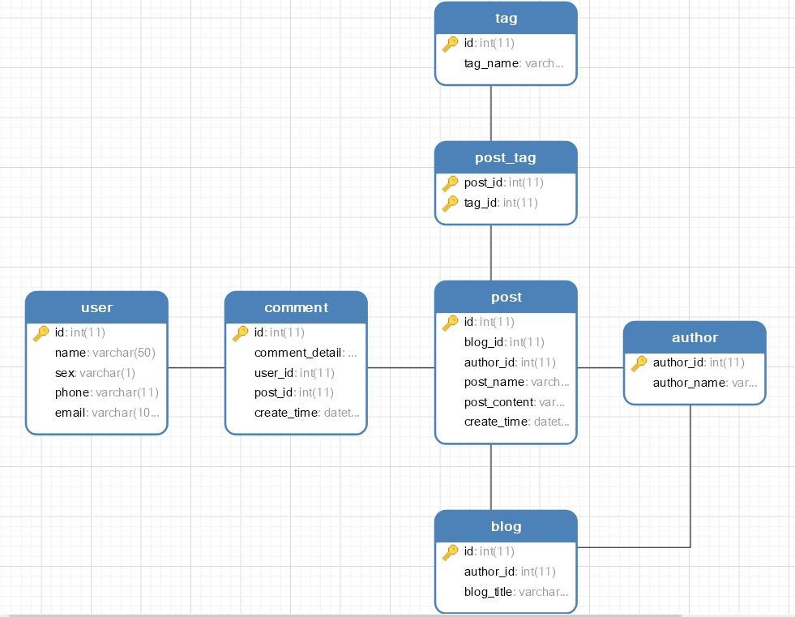
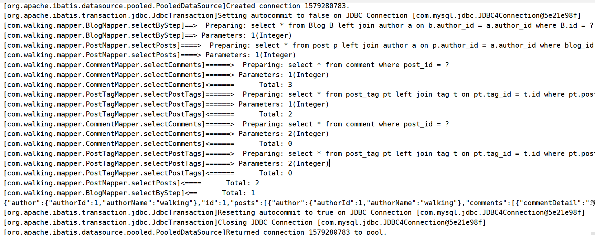

# walking_mybatis_join
Mybatis多表关联查询，一对多查询，分步查询示例

一个Blog对象包含作者、博文列表，每篇博文有0个或多个评论，以及0个或多个标签;

如下是数据库表的ER图



Blog这个复杂对象如何查询呢？下面就是通过mybatis查询的SQL日志


我们把它转化成真实的SQL来看看：
```sql
# restore sql from selection  - ==>
select *
 FROM Blog B
 LEFT JOIN author a
 ON b.author_id = a.author_id
 WHERE B.id = 1;
-- ---------------------------------------------------------------------------------------------------------------------
# restore sql from selection  - ==>
select *
 FROM post p
 LEFT JOIN author a
 ON p.author_id = a.author_id
 WHERE blog_id = 1;
-- ---------------------------------------------------------------------------------------------------------------------
# restore sql from selection  - ==>
select *
 FROM comment
 WHERE post_id = 1;
-- ---------------------------------------------------------------------------------------------------------------------
# restore sql from selection  - ==>
select *
 FROM post_tag pt
 LEFT JOIN tag t
 ON pt.tag_id = t.id
 WHERE pt.post_id = 1;
-- ---------------------------------------------------------------------------------------------------------------------
# restore sql from selection  - ==>
select *
 FROM comment
 WHERE post_id = 2;
-- ---------------------------------------------------------------------------------------------------------------------
# restore sql from selection  - ==>
select *
 FROM post_tag pt
 LEFT JOIN tag t
 ON pt.tag_id = t.id
 WHERE pt.post_id = 2;
```
这就是利用Mybatis的关联查询的特性实现的效果，事实上我们执行了多个SQL。

例如：
```xml
<resultMap id="detailedBlogResultMap" type="blog">
    <id property="id" column="id"/>
    <result property="title" column="blog_title"/>
    <association property="author" resultMap="com.walking.mapper.AuthorMapper.author"/>
    <collection property="posts" column="id" select="com.walking.mapper.PostMapper.selectPosts"/>
</resultMap>
```

```xml
<select id="selectByStep" resultMap="detailedBlogResultMap" parameterType="int">
  select
       *
  from Blog B
  left join author a
  on b.author_id = a.author_id
  where B.id = #{id}
</select>
```
当我们查询Blog对象时，我们只查了Blog表和author表，又因为我们的Blog对象里有一个List\<Post\>成员变量，
所以在结果映射里我们使用collection这个标签来表示这个集合，然后使用这个标签的select属性告诉mybatis查询这个集
合应该去执行哪个SQL，并通column将指定列的值传给这个SQL，这就实现了分步查询。
